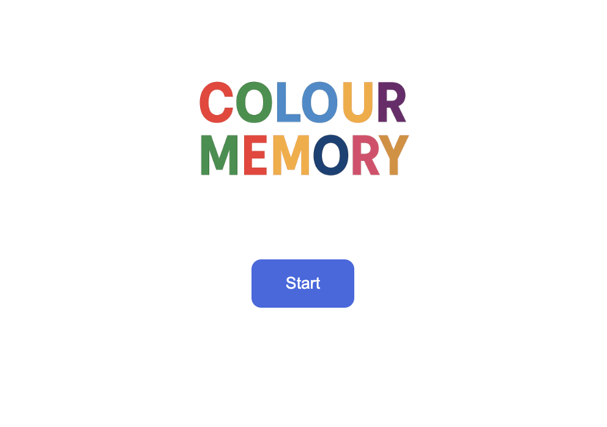
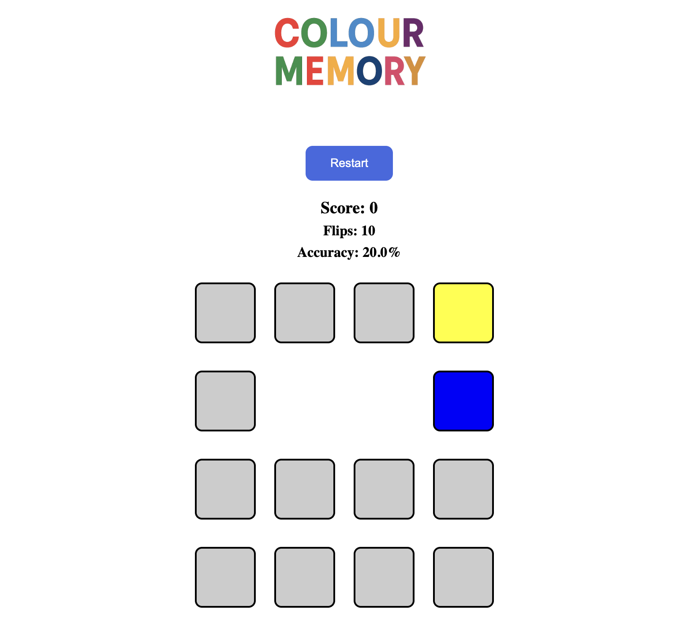
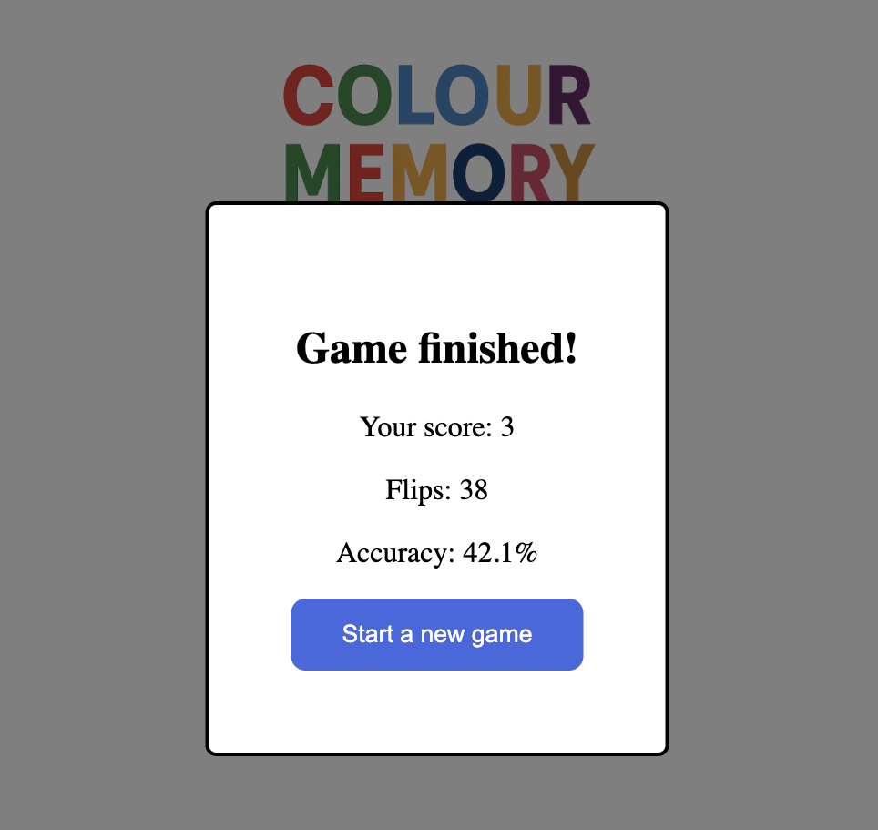

# Colour Memory

Ett fullstack memory-spel där du matchar färgpar. Byggd som kodtest för Decerno.



## 🎮 Spelregler

- Klicka på kort för att vända dem
- Matcha två kort med samma färg för att få poäng
- Matchade par försvinner från brädet efter 2 sekunder
- Varje match ger **+1 poäng**, varje missmatch **-1 poäng**
- Spelet slutar när alla 8 par är matchade

## 🛠️ Tech Stack

### Backend
- **Spring Boot** (Java 21)
- REST API

### Frontend
- **React** + **TypeScript**
- **Vite** (build tool)

## 🚀 Setup & Körning

### Krav
- Java 21
- Node.js 18+
- Maven

### Backend
```bash
cd backend
mvn spring-boot:run
```
Servern körs på `http://localhost:8080`

### Frontend
```bash
cd frontend
npm install
npm run dev
```
Applikationen körs på `http://localhost:5173`

## 📸 Screenshots

### Pågående spel


### Spelet avslutat


## 📝 API Endpoints

| Method | Endpoint | Beskrivning |
|--------|----------|-------------|
| POST | `/api/game/start` | Startar ett nytt spel |
| POST | `/api/game/flip/{position}` | Vänder kort på position 0-15 |

## 🚧 Framtida förbättringar

### Säkerhet & Skalbarhet
- **Anti-cheat**: Skicka DTO från backend utan att avslöja färger, avslöja endast vid flip
- **Session management**: Game session ID för att hantera flera samtidiga spel

### Features
- **Databas integration**: Spara highscores, längsta matchningsstreak, spelarstatistik
- **Flexibel grid-storlek**: Dynamisk layout som anpassas efter antal kort (inte bara 4x4)
- **Multiplayer**: Turas om att matcha kort, tävla om högsta score
- **Animationer**: Fler visuella effekter och övergångar

---

*Utvecklad som kodtest för Decerno*
